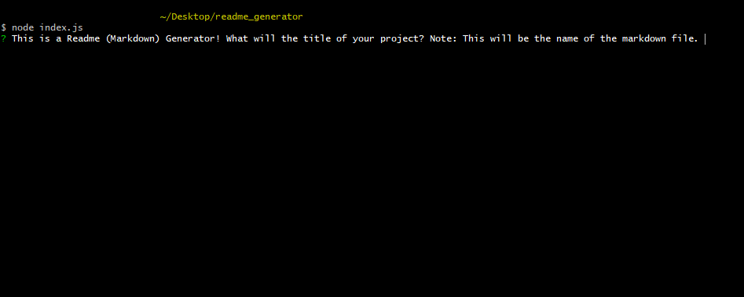

# README Generator

## Table of Content: 
* [Deploy link](#Deploy-link)
* [Description](#Description)
* [Installation](#Installation)
* [User Guide](#User-Guide)
* [Third Party Package](#Third-party-package-used)
* [Screenshot](#Screenshot)
* [Demo](#Demo)
* [Contact](#Contact)

## Deploy Link
https://github.com/Aurorachama/readme_generator

## Description 

This is a command line application to generate a readme(markdown) file for developers to use in their repositories

## Installation 
***This application relies on node.js as its run-time enviornment. Please install node.js before using this application***

**For information about node.js : [Node.js](https://nodejs.org/)**
* Clone this project using git clone <url> or Download ZIP, then use a command line to  run ``` npm i ``` to install necessary packages (inquirer)

## User Guide 

* Once installation is finished, user can type 
``` 
node index.js
```
or 
``` 
npm start
```
to run the code. 

* Then, prompt of question will be shown for users to type in their response
```
Every question is validated so empty response are not allowed
```
**This is to prevent auto-finishing and aims to let user read carefully about the prompt of the generator**

* A readme (markdown) file will be generated according to the response
* The file will be generated within the README Generator folder


## Third party package used
[Inquirer](https://github.com/SBoudrias/Inquirer.js)


## Screenshot
**GitBash is used to commence the application but other commend line works the same**


**Every question and the success message**


**The product and its path(inside the README Generator folder)**


## Demo
Here is a video demo of how the application will works and where the access the generated file
[](https://watch.screencastify.com/v/Ex52W3MWXtKxMxbUEcau)
### Contact 

Github: [Aurorachama](https://github.com/Aurorachama)
